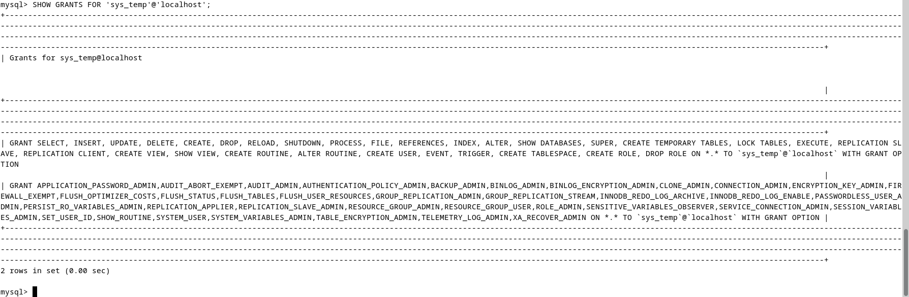

# Домашнее задание к занятию "`Название занятия`" - `Фамилия и имя студента`


### Инструкция по выполнению домашнего задания

   1. Сделайте `fork` данного репозитория к себе в Github и переименуйте его по названию или номеру занятия, например, https://github.com/имя-вашего-репозитория/git-hw или  https://github.com/имя-вашего-репозитория/7-1-ansible-hw).
   2. Выполните клонирование данного репозитория к себе на ПК с помощью команды `git clone`.
   3. Выполните домашнее задание и заполните у себя локально этот файл README.md:
      - впишите вверху название занятия и вашу фамилию и имя
      - в каждом задании добавьте решение в требуемом виде (текст/код/скриншоты/ссылка)
      - для корректного добавления скриншотов воспользуйтесь [инструкцией "Как вставить скриншот в шаблон с решением](https://github.com/netology-code/sys-pattern-homework/blob/main/screen-instruction.md)
      - при оформлении используйте возможности языка разметки md (коротко об этом можно посмотреть в [инструкции  по MarkDown](https://github.com/netology-code/sys-pattern-homework/blob/main/md-instruction.md))
   4. После завершения работы над домашним заданием сделайте коммит (`git commit -m "comment"`) и отправьте его на Github (`git push origin`);
   5. Для проверки домашнего задания преподавателем в личном кабинете прикрепите и отправьте ссылку на решение в виде md-файла в вашем Github.
   6. Любые вопросы по выполнению заданий спрашивайте в чате учебной группы и/или в разделе “Вопросы по заданию” в личном кабинете.
   
Желаем успехов в выполнении домашнего задания!
   
### Дополнительные материалы, которые могут быть полезны для выполнения задания

1. [Руководство по оформлению Markdown файлов](https://gist.github.com/Jekins/2bf2d0638163f1294637#Code)

---

### Задание 1  
  
1.1. Поднимите чистый инстанс MySQL версии 8.0+. Можно использовать локальный сервер или контейнер Docker.  
#### Ответ:  
``` bash
$ docker run --name mysql-debian1 -e MYSQL_ROOT_PASSWORD=mysqlpasswd -d mysql:8.0.40-debian
$ docker container ls
CONTAINER ID   IMAGE                           COMMAND                  CREATED          STATUS          PORTS                                       NAMES
15d2819964d7   mysql:8.0.40-debian             "docker-entrypoint.s…"   33 seconds ago   Up 32 seconds   3306/tcp, 33060/tcp                         mysql-debian1
```
  
1.2. Создайте учётную запись sys_temp.    
#### Ответ:  
``` bash
$ docker exec -it mysql-debian1 mysql -uroot -p
mysql> CREATE USER 'sys_temp'@'localhost' IDENTIFIED BY 'temppasswd';
Query OK, 0 rows affected (0.01 sec)
```
  
1.3. Выполните запрос на получение списка пользователей в базе данных. (скриншот)  
#### Ответ:  
``` bash
mysql> SELECT User FROM mysql.user;
```
  
  
1.4. Дайте все права для пользователя sys_temp.  
#### Ответ:  
``` bash
mysql> GRANT ALL PRIVILEGES ON *.* TO 'sys_temp'@'localhost' WITH GRANT OPTION;
Query OK, 0 rows affected, 1 warning (0.02 sec)
```  
  
1.5. Выполните запрос на получение списка прав для пользователя sys_temp. (скриншот)  
#### Ответ:  
Вариант 1:  
``` bash
mysql> SHOW GRANTS FOR 'sys_temp'@'localhost';
```

  
Вариант 2:  
``` bash
mysql> SELECT GRANTEE, PRIVILEGE_TYPE FROM information_schema.user_privileges WHERE GRANTEE like "'sys_temp'%";
```

  
1.6. Переподключитесь к базе данных от имени sys_temp.  
Для смены типа аутентификации с sha2 используйте запрос:  
ALTER USER 'sys_temp'@'localhost' IDENTIFIED WITH mysql_native_password BY 'password';  
#### Ответ:  
``` bash
mysql> exit
$ docker exec -it mysql-debian1 mysql -u sys_temp -ptemppasswd -h localhost
mysql> SELECT USER();
+--------------------+
| USER()             |
+--------------------+
| sys_temp@localhost |
+--------------------+
1 row in set (0.00 sec)
```  

  
1.6. По ссылке https://downloads.mysql.com/docs/sakila-db.zip скачайте дамп базы данных.  
1.7. Восстановите дамп в базу данных.  
#### Ответ:  
1. Expose two directories - one for datadir adn another for backups  
``` bash
$ mkdir ~/HW-12-DataBases/02-files/mysql-datadir
$ mkdir ~/HW-12-DataBases/02-files/mysql-backups
```
2. Run mysql container with binded volumes from created directories  
``` bash
$ docker run --name mysql-debian1 \
--mount type=bind,src=/home/user/HW-12-DataBases/02-files/mysql-datadir,dst=/var/lib/mysql \
--mount type=bind,src=/home/user/HW-12-DataBases/02-files/mysql-backups,dst=/data/backups \ 
-e MYSQL_ROOT_PASSWORD=rootpasswd \
-d mysql:8.0.40-debian
```  
3. Create new database which will be restored from db sakila backup  
``` bash
$ docker exec -it mysql-debian1 mysql -u sys_temp -ptemppasswd
mysql> CREATE DATABASE sakila;
```  
4. Connect to shell of running container and execute database restoring process
``` bash
$ docker exec -it mysql-debian1 bash
# then restore sakila database schema
root@c324a604aef2:/# cat /data/backups/sakila-schema.sql | grep -v ^INSERT | mysql -u sys_temp -ptemppasswd sakila 
# then restore tables with their data
root@c324a604aef2:/# cat /data/backups/sakila-data.sql | mysql -u sys_temp --password=temppasswd sakila
# then connect throught mysql cli to sakila database with sys_temp user
root@c324a604aef2:/# mysql -u sys_temp -ptemppasswd sakila
# then check database tables
mysql> show tables;
+----------------------------+
| Tables_in_sakila           |
+----------------------------+
| actor                      |
| actor_info                 |
| address                    |
| category                   |
| city                       |
| country                    |
| customer                   |
| customer_list              |
| film                       |
| film_actor                 |
| film_category              |
| film_list                  |
| film_text                  |
| inventory                  |
| language                   |
| nicer_but_slower_film_list |
| payment                    |
| rental                     |
| sales_by_film_category     |
| sales_by_store             |
| staff                      |
| staff_list                 |
| store                      |
+----------------------------+
```  

1.8. При работе в IDE сформируйте ER-диаграмму получившейся базы данных. При работе в командной строке используйте команду для получения всех таблиц базы данных. (скриншот)  
Результатом работы должны быть скриншоты обозначенных заданий, а также простыня со всеми запросами.  
#### Ответ:  
As shown above:
  
  
### Задание 2
Составьте таблицу, используя любой текстовый редактор или Excel, в которой должно быть два столбца: в первом должны быть названия таблиц восстановленной базы, во втором названия первичных ключей этих таблиц. Пример: (скриншот/текст)

Название таблицы | Название первичного ключа
customer         | customer_id

#### Ответ:  
While connected to mysql cli:  
``` bash
mysql> SELECT TABLE_NAME, COLUMN_NAME
    -> FROM INFORMATION_SCHEMA.COLUMNS
    -> WHERE TABLE_SCHEMA = 'sakila' AND COLUMN_KEY = 'PRI' ORDER BY table_name;
```


---

Дополнительные задания (со звёздочкой*)
Эти задания дополнительные, то есть не обязательные к выполнению, и никак не повлияют на получение вами зачёта по этому домашнему заданию. Вы можете их выполнить, если хотите глубже шире разобраться в материале.

### Задание 3*
3.1. Уберите у пользователя sys_temp права на внесение, изменение и удаление данных из базы sakila.  
#### Ответ:  
``` bash
mysql> REVOKE INSERT, UPDATE, DELETE ON `sakila`.* FROM 'sys_temp'@'localhost';
Query OK, 0 rows affected, 1 warning (0.00 sec)
```
  
3.2. Выполните запрос на получение списка прав для пользователя sys_temp. (скриншот)  
#### Ответ:  
``` bash
mysql> SHOW GRANTS FOR 'sys_temp'@'localhost';
```  


Результатом работы должны быть скриншоты обозначенных заданий, а также простыня со всеми запросами.
