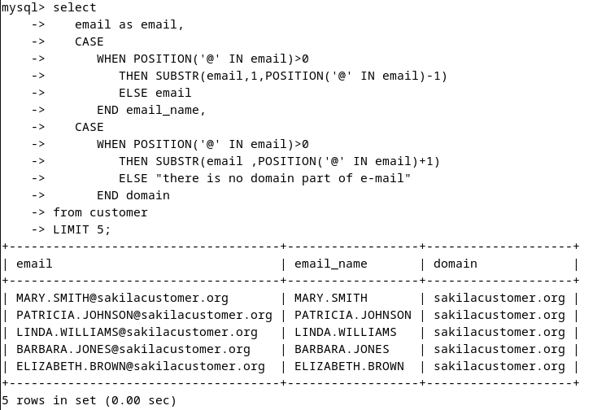
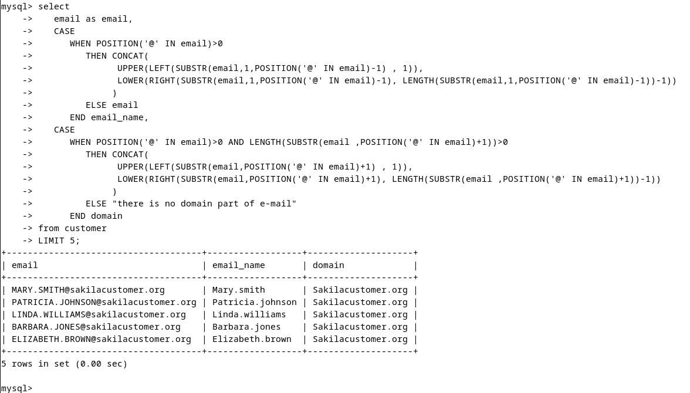

# Домашнее задание к занятию "`SQL. Часть 1`" - `Алексеев Александр`


### Инструкция по выполнению домашнего задания

   1. Сделайте `fork` данного репозитория к себе в Github и переименуйте его по названию или номеру занятия, например, https://github.com/имя-вашего-репозитория/git-hw или  https://github.com/имя-вашего-репозитория/7-1-ansible-hw).
   2. Выполните клонирование данного репозитория к себе на ПК с помощью команды `git clone`.
   3. Выполните домашнее задание и заполните у себя локально этот файл README.md:
      - впишите вверху название занятия и вашу фамилию и имя
      - в каждом задании добавьте решение в требуемом виде (текст/код/скриншоты/ссылка)
      - для корректного добавления скриншотов воспользуйтесь [инструкцией "Как вставить скриншот в шаблон с решением](https://github.com/netology-code/sys-pattern-homework/blob/main/screen-instruction.md)
      - при оформлении используйте возможности языка разметки md (коротко об этом можно посмотреть в [инструкции  по MarkDown](https://github.com/netology-code/sys-pattern-homework/blob/main/md-instruction.md))
   4. После завершения работы над домашним заданием сделайте коммит (`git commit -m "comment"`) и отправьте его на Github (`git push origin`);
   5. Для проверки домашнего задания преподавателем в личном кабинете прикрепите и отправьте ссылку на решение в виде md-файла в вашем Github.
   6. Любые вопросы по выполнению заданий спрашивайте в чате учебной группы и/или в разделе “Вопросы по заданию” в личном кабинете.
   
Желаем успехов в выполнении домашнего задания!
   
### Дополнительные материалы, которые могут быть полезны для выполнения задания

1. [Руководство по оформлению Markdown файлов](https://gist.github.com/Jekins/2bf2d0638163f1294637#Code)

---

### Задание 1  
Получите уникальные названия районов из таблицы с адресами, которые начинаются на “K” и заканчиваются на “a” и не содержат пробелов.  
#### Ответ:  
``` bash
mysql> select distinct  adr.district from address as adr where district like "K%a";
```  

  
### Задание 2  
Получите из таблицы платежей за прокат фильмов информацию по платежам, которые выполнялись в промежуток с 15 июня 2005 года по 18 июня 2005 года включительно и стоимость которых превышает 10.00.
#### Ответ:  
``` bash
mysql> select * from payment where DATE(payment_date) between '2005-06-15' and '2005-06-18' and amount > 10.00;
```  

  
### Задание 3    
Получите последние пять аренд фильмов.  
#### Ответ:  
Не корректная формулировка вопроса: что такое "последнх аренд"?
* выданных последними в аренду?
* возвращенных последними из аренды??
Ввду кривой постановки вопроса делаю выборку по последним 5 выданным в аренду.
``` bash
mysql> select * from rental order by rental_date desc limit 5;
```  
  
  
### Задание 4  
Одним запросом получите активных покупателей, имена которых Kelly или Willie.  
Сформируйте вывод в результат таким образом:  
все буквы в фамилии и имени из верхнего регистра переведите в нижний регистр,  
замените буквы 'll' в именах на 'pp'.  
Дополнительные задания (со звёздочкой*)  
Эти задания дополнительные, то есть не обязательные к выполнению, и никак не повлияют на получение вами зачёта по этому домашнему заданию. Вы можете их выполнить, если хотите глубже шире разобраться в материале.  
#### Ответ:  
Не корректная формулировка вопроса: в таблице customer имеются 2 поля, связнных с именем покупателя:
* first_name: The customer first name.
* last_name: The customer last name.
Ввиду кривой постановки задачи выборка будет вестись по обоим полям.  
И перевод в нижний регистр будет сделан также для значений всех полей, если хотя бы одно из полей удовлетворяет условию.
``` bash
select 
   CASE 
      WHEN LOWER(first_name)='willie' or LOWER(first_name)='kelly' 
         THEN REPLACE(LOWER(first_name), 'll', 'rr') 
         ELSE LOWER(first_name) 
      END first_name, 
   CASE 
      WHEN LOWER(last_name)='willie' or LOWER(last_name)='kelly' 
         THEN REPLACE(LOWER(last_name), 'll', 'rr') 
         ELSE LOWER(last_name) 
      END last_name
from customer 
WHERE active = TRUE 
   and (
         LOWER(first_name)="willie" 
         or LOWER(last_name)="willie" 
         or LOWER(first_name)="kelly" 
         or LOWER(last_name)="kelly"
      );
```  


---  
  
Дополнительные задания (со звёздочкой*)  
Эти задания дополнительные, то есть не обязательные к выполнению, и никак не повлияют на получение вами зачёта по этому домашнему заданию. Вы можете их выполнить, если хотите глубже шире разобраться в материале.  
  
### Задание 5*  
Выведите Email каждого покупателя, разделив значение Email на две отдельных колонки: в первой колонке должно быть значение, указанное до @, во второй — значение, указанное после @.  
#### Ответ:  
``` bash
select 
   email as email, 
   CASE 
      WHEN POSITION('@' IN email)>0 AND LENGTH(SUBSTR(email,1,POSITION('@' IN email)-1))>0
         THEN SUBSTR(email,1,POSITION('@' IN email)-1) 
         ELSE email
      END email_name, 
   CASE   
      WHEN POSITION('@' IN email)>0 AND LENGTH(SUBSTR(email ,POSITION('@' IN email)+1))>0
         THEN SUBSTR(email ,POSITION('@' IN email)+1) 
         ELSE "there is no domain part of e-mail"
      END domain 
from customer 
LIMIT 5;
```

  
### Задание 6*  
Доработайте запрос из предыдущего задания, скорректируйте значения в новых колонках: первая буква должна быть заглавной, остальные — строчными.  
#### Ответ:  
``` bash
select 
   email as email, 
   CASE 
      WHEN POSITION('@' IN email)>0
         THEN CONCAT(
               UPPER(LEFT(SUBSTR(email,1,POSITION('@' IN email)-1) , 1)), 
               LOWER(RIGHT(SUBSTR(email,1,POSITION('@' IN email)-1), LENGTH(SUBSTR(email,1,POSITION('@' IN email)-1))-1))
              )
         ELSE email
      END email_name, 
   CASE   
      WHEN POSITION('@' IN email)>0 AND LENGTH(SUBSTR(email ,POSITION('@' IN email)+1))>0
         THEN CONCAT(
               UPPER(LEFT(SUBSTR(email,POSITION('@' IN email)+1) , 1)), 
               LOWER(RIGHT(SUBSTR(email,POSITION('@' IN email)+1), LENGTH(SUBSTR(email ,POSITION('@' IN email)+1))-1))
              ) 
         ELSE "there is no domain part of e-mail"
      END domain 
from customer 
LIMIT 5;
```  
  