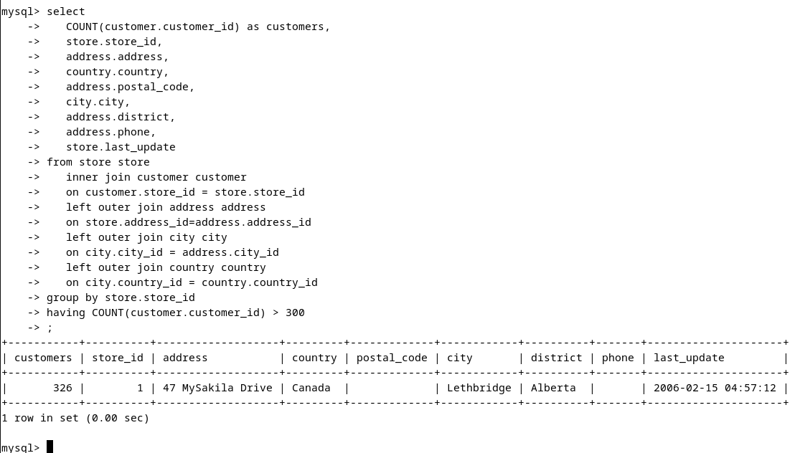
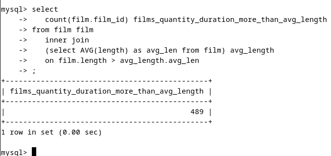
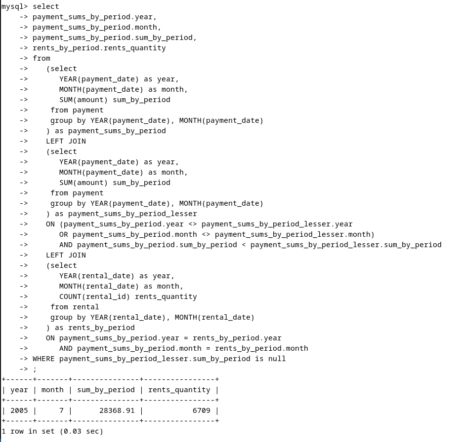
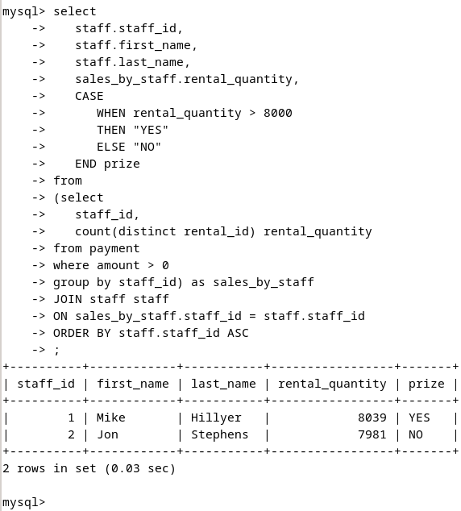
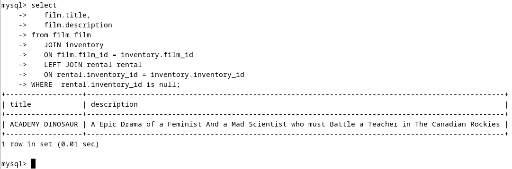

# Домашнее задание к занятию "`Название занятия`" - `Фамилия и имя студента`


### Инструкция по выполнению домашнего задания

   1. Сделайте `fork` данного репозитория к себе в Github и переименуйте его по названию или номеру занятия, например, https://github.com/имя-вашего-репозитория/git-hw или  https://github.com/имя-вашего-репозитория/7-1-ansible-hw).
   2. Выполните клонирование данного репозитория к себе на ПК с помощью команды `git clone`.
   3. Выполните домашнее задание и заполните у себя локально этот файл README.md:
      - впишите вверху название занятия и вашу фамилию и имя
      - в каждом задании добавьте решение в требуемом виде (текст/код/скриншоты/ссылка)
      - для корректного добавления скриншотов воспользуйтесь [инструкцией "Как вставить скриншот в шаблон с решением](https://github.com/netology-code/sys-pattern-homework/blob/main/screen-instruction.md)
      - при оформлении используйте возможности языка разметки md (коротко об этом можно посмотреть в [инструкции  по MarkDown](https://github.com/netology-code/sys-pattern-homework/blob/main/md-instruction.md))
   4. После завершения работы над домашним заданием сделайте коммит (`git commit -m "comment"`) и отправьте его на Github (`git push origin`);
   5. Для проверки домашнего задания преподавателем в личном кабинете прикрепите и отправьте ссылку на решение в виде md-файла в вашем Github.
   6. Любые вопросы по выполнению заданий спрашивайте в чате учебной группы и/или в разделе “Вопросы по заданию” в личном кабинете.
   
Желаем успехов в выполнении домашнего задания!
   
### Дополнительные материалы, которые могут быть полезны для выполнения задания

1. [Руководство по оформлению Markdown файлов](https://gist.github.com/Jekins/2bf2d0638163f1294637#Code)

---

### Задание 1
Одним запросом получите информацию о магазине, в котором обслуживается более 300 покупателей, и выведите в результат следующую информацию:  
фамилия и имя сотрудника из этого магазина;  
город нахождения магазина;  
количество пользователей, закреплённых в этом магазине.  
#### Ответ:  
Не корректная формулировка задания: в таблице customer есть поле store_id: A foreign key identifying the customer “home store.” Customers are not limited to renting only from this store, but this is the store at which they generally shop.
Из текста задания не ясно - какой результат нужен - то-ли по "приписанным к магазинам покупателям", то-ли по фактическим продажам (за какой промежуток времени?).
К тому же не ясно - какая именно "информация" нужна о магазине?? 
Ввиду кривой формулировки задания выборка будет дана по "приписанным к магазинам покупателям", "информация" будет выведена по адресу, телефону магазина и дате последнего обновления.
``` bash
mysql> select
   COUNT(customer.customer_id) as customers,
   store.store_id,
   address.address,
   country.country,
   address.postal_code,
   city.city,
   address.district,
   address.phone,
   store.last_update
from store store
   inner join customer customer
   on customer.store_id = store.store_id
   left outer join address address
   on store.address_id=address.address_id
   left outer join city city
   on city.city_id = address.city_id
   left outer join country country
   on city.country_id = country.country_id
group by store.store_id
having COUNT(customer.customer_id) > 300
;
```  



### Задание 2  
Получите количество фильмов, продолжительность которых больше средней продолжительности всех фильмов.  
#### Ответ: 
``` bash
mysql> select
   count(film.film_id) films_quantity_duration_more_than_avg_length
from film film
   inner join
   (select AVG(length) as avg_len from film) avg_length
   on film.length > avg_length.avg_len
;
```  
  
  
### Задание 3  
Получите информацию, за какой месяц была получена наибольшая сумма платежей, и добавьте информацию по количеству аренд за этот месяц.  
#### Ответ:  
Странная постановка задачи. Год платежа - не важен?  
``` bash
mysql> 
select 
payment_sums_by_period.year,
payment_sums_by_period.month,
payment_sums_by_period.sum_by_period,
rents_by_period.rents_quantity
from
   (select 
      YEAR(payment_date) as year, 
      MONTH(payment_date) as month, 
      SUM(amount) sum_by_period
    from payment
    group by YEAR(payment_date), MONTH(payment_date)
   ) as payment_sums_by_period
   LEFT JOIN 
   (select 
      YEAR(payment_date) as year, 
      MONTH(payment_date) as month, 
      SUM(amount) sum_by_period
    from payment
    group by YEAR(payment_date), MONTH(payment_date) 
   ) as payment_sums_by_period_lesser
   ON (payment_sums_by_period.year <> payment_sums_by_period_lesser.year
      OR payment_sums_by_period.month <> payment_sums_by_period_lesser.month)
      AND payment_sums_by_period.sum_by_period < payment_sums_by_period_lesser.sum_by_period
   LEFT JOIN
   (select
      YEAR(rental_date) as year, 
      MONTH(rental_date) as month,
      COUNT(rental_id) rents_quantity
    from rental
    group by YEAR(rental_date), MONTH(rental_date)
   ) as rents_by_period
   ON payment_sums_by_period.year = rents_by_period.year
      AND payment_sums_by_period.month = rents_by_period.month
WHERE payment_sums_by_period_lesser.sum_by_period is null
;
```
  
  
--- 

Дополнительные задания (со звёздочкой*)  
Эти задания дополнительные, то есть не обязательные к выполнению, и никак не повлияют на получение вами зачёта по этому домашнему заданию. Вы можете их выполнить, если хотите глубже шире разобраться в материале.  
  
### Задание 4*  
Посчитайте количество продаж, выполненных каждым продавцом. Добавьте вычисляемую колонку «Премия». Если количество продаж превышает 8000, то значение в колонке будет «Да», иначе должно быть значение «Нет».  
#### Ответ:  
Нечеткая постановка задания.  
Под выполненой продажей буду понимать сдачу в аренду с полученной оплатой.  
``` bash
select
   staff.staff_id,
   staff.first_name,
   staff.last_name,
   sales_by_staff.rental_quantity,
   CASE
      WHEN rental_quantity > 8000
      THEN "YES"
      ELSE "NO"
   END prize
from
(select
   staff_id,
   count(distinct rental_id) rental_quantity
from payment
where amount > 0
group by staff_id) as sales_by_staff
JOIN staff staff
ON sales_by_staff.staff_id = staff.staff_id
ORDER BY staff.staff_id ASC
;
```  
  
  
### Задание 5*  
Найдите фильмы, которые ни разу не брали в аренду.  
#### Ответ:  
``` bash
select
   film.title,
   film.description
from film film
   JOIN inventory
   ON film.film_id = inventory.film_id
   LEFT JOIN rental rental
   ON rental.inventory_id = inventory.inventory_id
WHERE  rental.inventory_id is null
;
```

