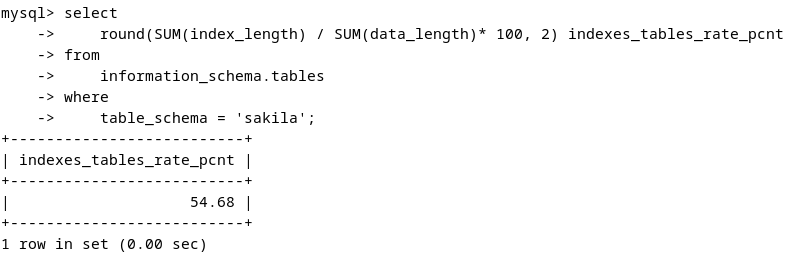

# Домашнее задание к занятию "`Индексы`" - `Алексеев Александр`


### Инструкция по выполнению домашнего задания

   1. Сделайте `fork` данного репозитория к себе в Github и переименуйте его по названию или номеру занятия, например, https://github.com/имя-вашего-репозитория/git-hw или  https://github.com/имя-вашего-репозитория/7-1-ansible-hw).
   2. Выполните клонирование данного репозитория к себе на ПК с помощью команды `git clone`.
   3. Выполните домашнее задание и заполните у себя локально этот файл README.md:
      - впишите вверху название занятия и вашу фамилию и имя
      - в каждом задании добавьте решение в требуемом виде (текст/код/скриншоты/ссылка)
      - для корректного добавления скриншотов воспользуйтесь [инструкцией "Как вставить скриншот в шаблон с решением](https://github.com/netology-code/sys-pattern-homework/blob/main/screen-instruction.md)
      - при оформлении используйте возможности языка разметки md (коротко об этом можно посмотреть в [инструкции  по MarkDown](https://github.com/netology-code/sys-pattern-homework/blob/main/md-instruction.md))
   4. После завершения работы над домашним заданием сделайте коммит (`git commit -m "comment"`) и отправьте его на Github (`git push origin`);
   5. Для проверки домашнего задания преподавателем в личном кабинете прикрепите и отправьте ссылку на решение в виде md-файла в вашем Github.
   6. Любые вопросы по выполнению заданий спрашивайте в чате учебной группы и/или в разделе “Вопросы по заданию” в личном кабинете.
   
Желаем успехов в выполнении домашнего задания!
   
### Дополнительные материалы, которые могут быть полезны для выполнения задания

1. [Руководство по оформлению Markdown файлов](https://gist.github.com/Jekins/2bf2d0638163f1294637#Code)

---

### Задание 1
Напишите запрос к учебной базе данных, который вернёт процентное отношение общего размера всех индексов к общему размеру всех таблиц.  
#### Ответ:  
``` bash
select 
    round(SUM(index_length) / SUM(data_length)* 100, 2) indexes_tables_rate_pcnt
from 
    information_schema.tables
where 
    table_schema = 'sakila';
```  
 

### Задание 2
Выполните explain analyze следующего запроса:
``` bash 
select distinct concat(c.last_name, ' ', c.first_name), sum(p.amount) over (partition by c.customer_id, f.title)
from payment p, rental r, customer c, inventory i, film f
where date(p.payment_date) = '2005-07-30' and p.payment_date = r.rental_date and r.customer_id = c.customer_id and i.inventory_id = r.inventory_id
;
```  
перечислите узкие места;  
оптимизируйте запрос: внесите корректировки по использованию операторов, при необходимости добавьте индексы.  

#### Ответ: 
1. EXPLAIN ANALYZE: 
``` bash 
| -> Table scan on <temporary>  (cost=2.5..2.5 rows=0) (actual time=3702..3702 rows=391 loops=1)  
    -> Temporary table with deduplication  (cost=0..0 rows=0) (actual time=3702..3702 rows=391 loops=1)  
        -> Window aggregate with buffering: sum(payment.amount) OVER (PARTITION BY c.customer_id,f.title )   (actual time=1479..3575 rows=642000 loops=1)  
            -> Sort: c.customer_id, f.title  (actual time=1479..1515 rows=642000 loops=1)  
                -> Stream results  (cost=21.3e+6 rows=16e+6) (actual time=1.28..1159 rows=642000 loops=1)  
                    -> Nested loop inner join  (cost=21.3e+6 rows=16e+6) (actual time=1.27..995 rows=642000 loops=1)  
                        -> Nested loop inner join  (cost=19.7e+6 rows=16e+6) (actual time=1.27..879 rows=642000 loops=1)  
                            -> Nested loop inner join  (cost=18.1e+6 rows=16e+6) (actual time=1.26..758 rows=642000 loops=1)  
                                -> Inner hash join (no condition)  (cost=1.54e+6 rows=15.4e+6) (actual time=1.23..27.3 rows=634000 loops=1)  
                                    -> Filter: (cast(p.payment_date as date) = '2005-07-30')  (cost=1.61 rows=15400) (actual time=0.572..3.94 rows=634 loops=1)  
                                        -> Table scan on p  (cost=1.61 rows=15400) (actual time=0.55..2.93 rows=16044 loops=1)  
                                    -> Hash  
                                        -> Covering index scan on f using idx_title  (cost=112 rows=1000) (actual time=0.0605..0.501 rows=1000 loops=1)  
                                -> Covering index lookup on r using rental_date (rental_date=p.payment_date)  (cost=0.969 rows=1.04) (actual time=752e-6..0.00107 rows=1.01 loops=634000)  
                            -> Single-row index lookup on c using PRIMARY (customer_id=r.customer_id)  (cost=250e-6 rows=1) (actual time=96.4e-6..110e-6 rows=1 loops=642000)  
                        -> Single-row covering index lookup on i using PRIMARY (inventory_id=r.inventory_id)  (cost=250e-6 rows=1) (actual time=82.3e-6..96e-6 rows=1 loops=642000)  
 |
 1 row in set (3.72 sec)  
```  
2. Узкие места  
Цель запроса: Исходя из полей выборки, целью запроса является получение суммы платежей по потребителям за указаную дату '2005-07-30' с выводом полного имени потребителя в однй строку.  
В предложенном варианте для решения применена оконная функция с буферизацией (Window aggregate with buffering), которая, в условиях большого количества таблиц, влечет за собой удорожание процесса получения результата из-за:  
* обработки большого количества строк (642000) с затратой времени на устранение дубликатов строк (Temporary table with deduplication) и сортировку данных по customer_id и file.title (операция Sort);  
* при этом сортировка по file.title фактически только запутывает выводимый результат - потребители и суммы выводятся без понятной сортировки;  
* а также множества излишних - фактически не используемых в конечном результате - процессов соединений (Nested loop inner join).  

3. Оптимизация запроса.  
Исходя из цели запроса, определяемой полями выборки - как данными потребителя и суммой платежей по ним, предлагается привести запрос к виду  
``` bash
select distinct
   concat(c.last_name, ' ', c.first_name), 
   sum(p.amount) over (partition by c.customer_id) 
from payment p 
      join customer c 
         on p.customer_id = c.customer_id  
where p.payment_date >= '2005-07-30' AND p.payment_date < DATE_ADD('2005-07-30', INTERVAL 1 DAY)
;
```  
EXPLAIN ANALYZE дает:  
``` bash
| -> Table scan on <temporary>  (cost=2.5..2.5 rows=0) (actual time=4.79..4.81 rows=391 loops=1)
    -> Temporary table with deduplication  (cost=0..0 rows=0) (actual time=4.79..4.79 rows=391 loops=1)
        -> Window aggregate with buffering: sum(payment.amount) OVER (PARTITION BY c.customer_id )   (actual time=4.13..4.68 rows=634 loops=1)
            -> Sort: c.customer_id  (actual time=4.11..4.14 rows=634 loops=1)
                -> Stream results  (cost=507 rows=634) (actual time=0.715..3.85 rows=634 loops=1)
                    -> Nested loop inner join  (cost=507 rows=634) (actual time=0.708..3.46 rows=634 loops=1)
                        -> Index range scan on p using idx_payment_date over ('2005-07-30 00:00:00' <= payment_date < '2005-07-31 00:00:00'), with index condition: ((p.payment_date >= TIMESTAMP'2005-07-30 00:00:00') and (p.payment_date < <cache>(('2005-07-30' + interval 1 day))))  (cost=286 rows=634) (actual time=0.693..1.86 rows=634 loops=1)
                        -> Single-row index lookup on c using PRIMARY (customer_id=p.customer_id)  (cost=0.25 rows=1) (actual time=0.00219..0.00224 rows=1 loops=634)
 |
1 row in set (0.01 sec)
```

Объяснение:
1. Упраздняем ранее использовавшиеся таблицы - т.к. их данные фактически не используются в конечном результате запроса (достаточно таблиц payment и customer);  
2. Изменяем условие отбора на поле p.payment_date: вместо использования функции date и проверки её результата, используем условие интервала дат для оригинального поля p.payment_date.  
Развитием этой оптимизации может послужить добавление индекса на поле p.payment_date - по аналогии с имеющимся индексом на поле rental.rental_date.
``` bash
CREATE INDEX idx_payment_date ON payment (payment_date);
```
Однако дополнительный индекс увеличит расходы в базе по его обслуживанию. И в целом может существено ухудшить результаты даже первоначального запроса из задания.  
В общем, и без него всё неплохо работает.
  
В заключение можно отметить второй вариант запроса - с отказом от оконной функции и переходом к обычной группировке:  
``` bash
select concat(c.last_name, ' ', c.first_name) as a, sum(p.amount) 
from payment p join customer c on p.customer_id = c.customer_id 
where p.payment_date >= '2005-07-30' AND p.payment_date < DATE_ADD('2005-07-30', INTERVAL 1 DAY) 
group by a;
```
EXPLAIN ANALYZE дает:  
``` bash
| -> Table scan on <temporary>  (actual time=3.09..3.12 rows=391 loops=1)
    -> Aggregate using temporary table  (actual time=3.09..3.09 rows=391 loops=1)
        -> Nested loop inner join  (cost=507 rows=634) (actual time=0.649..2.43 rows=634 loops=1)
            -> Index range scan on p using idx_payment_date over ('2005-07-30 00:00:00' <= payment_date < '2005-07-31 00:00:00'), with index condition: ((p.payment_date >= TIMESTAMP'2005-07-30 00:00:00') and (p.payment_date < <cache>(('2005-07-30' + interval 1 day))))  (cost=286 rows=634) (actual time=0.636..1.43 rows=634 loops=1)
            -> Single-row index lookup on c using PRIMARY (customer_id=p.customer_id)  (cost=0.25 rows=1) (actual time=0.00138..0.00141 rows=1 loops=634)
 |
1 row in set (0.01 sec)
```  
Данный вариант по сравнению с предыдущим является немного более быстрым.
И при отсутствии необходимости в конечном результате прочих полей (типа file.title) - более предпочтительным.

---

Дополнительные задания (со звёздочкой*)
Эти задания дополнительные, то есть не обязательные к выполнению, и никак не повлияют на получение вами зачёта по этому домашнему заданию. Вы можете их выполнить, если хотите глубже шире разобраться в материале.

### Задание 3*
Самостоятельно изучите, какие типы индексов используются в PostgreSQL. Перечислите те индексы, которые используются в PostgreSQL, а в MySQL — нет.
Приведите ответ в свободной форме.  
#### Ответ:  
В PostgreSQL поддерживается несколько типов индексов, которые обеспечивают гибкость при оптимизации запросов. Вот некоторые из них:
1. B-Tree: По умолчанию используемый тип индекса, оптимизированный для данных, которые можно сортировать. Используется в большинстве СУБД, включая MySQL.  
2. Hash: Используется для равенства значений. В MySQL также присутствуют, но их использование может быть ограничено.  
3. GiST (Generalized Search Tree): Это расширяемая инфраструктура для различных типов индексов, которые могут обрабатывать многомерные типы данных.  
4. SP-GiST (Space-Partitioned Generalized Search Tree): Подходит для данных с неравномерным распределением.  
5. GIN (Generalized Inverted Index): Подходит для индексации элементов, которые содержат много значений, например массивов или документов JSON.  
6. BRIN (Block Range INdexes): Предназначены для больших таблиц, где элементы схожих значений физически хранятся рядом друг с другом.

Индексы, которые есть в PostgreSQL и отсутствуют в MySQL:
* GiST: Этот тип индекса используется для создания различных балансирующих деревьев поиска, которые могут быть оптимизированы под разные типы данных.  
* SP-GiST: Особый тип индекса, который может быть использован для разделения пространства, например, для индексации деревьев и графов.  
* GIN: Используются для индексации составных значений, где один ключ может быть связан с множеством значений.  
* BRIN: Эффективны для больших таблиц, где значение столбца обычно увеличивается. Позволяют быстро находить блоки данных, содержащие интересующие диапазоны значений.
