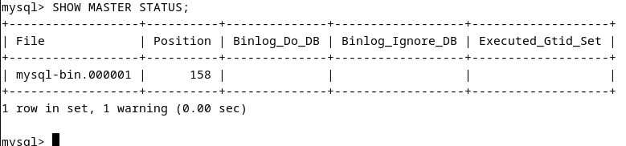

# Домашнее задание к занятию "`Репликация и масштабирование. Часть 1`" - `Алексеев Александр`


### Инструкция по выполнению домашнего задания

   1. Сделайте `fork` данного репозитория к себе в Github и переименуйте его по названию или номеру занятия, например, https://github.com/имя-вашего-репозитория/git-hw или  https://github.com/имя-вашего-репозитория/7-1-ansible-hw).
   2. Выполните клонирование данного репозитория к себе на ПК с помощью команды `git clone`.
   3. Выполните домашнее задание и заполните у себя локально этот файл README.md:
      - впишите вверху название занятия и вашу фамилию и имя
      - в каждом задании добавьте решение в требуемом виде (текст/код/скриншоты/ссылка)
      - для корректного добавления скриншотов воспользуйтесь [инструкцией "Как вставить скриншот в шаблон с решением](https://github.com/netology-code/sys-pattern-homework/blob/main/screen-instruction.md)
      - при оформлении используйте возможности языка разметки md (коротко об этом можно посмотреть в [инструкции  по MarkDown](https://github.com/netology-code/sys-pattern-homework/blob/main/md-instruction.md))
   4. После завершения работы над домашним заданием сделайте коммит (`git commit -m "comment"`) и отправьте его на Github (`git push origin`);
   5. Для проверки домашнего задания преподавателем в личном кабинете прикрепите и отправьте ссылку на решение в виде md-файла в вашем Github.
   6. Любые вопросы по выполнению заданий спрашивайте в чате учебной группы и/или в разделе “Вопросы по заданию” в личном кабинете.
   
Желаем успехов в выполнении домашнего задания!
   
### Дополнительные материалы, которые могут быть полезны для выполнения задания

1. [Руководство по оформлению Markdown файлов](https://gist.github.com/Jekins/2bf2d0638163f1294637#Code)

---

### Задание 1  
На лекции рассматривались режимы репликации master-slave, master-master, опишите их различия.  
Ответить в свободной форме.  
#### Ответ:
**1. Репликация Master-Slave**  
* В этом режиме существует один основной сервер (master), на котором производятся все изменения данных. Затем все изменения реплицируются на прочие серверы (slaves). Все прочие серверы предоставляют данные только для чтения. Соответственно, назначение прочих серверов - помощь в распределении нагрузки при выполнении запросов на чтение, а также исполнение роли резервных копии на случай восстановления после сбоев.
* Преимущества: Простота настройки и управления. Снижение нагрузки на основной сервер и улучшение производительности базы данных в целом при запросах на чтение.
* Недостатки: slave-серверы могут отставать от master при недостаточно быстром процессе репликации. При отказе master-сервера необходим механизм (или вмешательство администратора) для повышения slave до статуса master.

**2. Репликация Master-Master**
* Два или более серверов работают как основные. Каждый сервер реплицирует свои изменения в данных на другие серверы, что позволяет производить запись и чтение на всех серверах.  
* Преимущества:  Базы данных с таким режимом репликации обладают повышенной отказоустойчивостью, отказ одного сервера не приводит к потере доступности системы в целом.  Несколько master-серверов обеспечивают хорошее распределении нагрузки на базу данных в целом.  
* Недостатки:  систему с тким режимом репликации сложнее настроить и ей сложнее управлять, ввиду возможных коллизий при синхронизации данных, когда одновременно изменяются одни и те же данные на разных серверах. Это влечет больше накладных расходов на организацию работы серверов.


Для обоих режимов репликация может выполняться синхронно или асинхронно.  
Синхронный подход гарантирует, что все серверы будут содержать одини и те же данные в любой момент времени, но при нём ухудшается производительность базы данных в целом ввиду организации процессов синхронизации данных.  
Асинхронный подход обеспечивает более высокую производительность базы данных в целом, но при нём возникает риск того, что данные на разных серверах могут разойтись, ввиду чего возникает необходимость в периодических операциях сверки и при необходимости синхронизации данных.


### Задание 2  
Выполните конфигурацию master-slave репликации, примером можно пользоваться из лекции.  
Приложите скриншоты конфигурации, выполнения работы: состояния и режимы работы серверов.  
#### Ответ:
1. Конфигурация master
 

2. Конфигурация slave:  
``` bash
mysql> SHOW SLAVE STATUS\G
*************************** 1. row ***************************
               Slave_IO_State: Waiting for source to send event
                  Master_Host: replica-master
                  Master_User: replication
                  Master_Port: 3306
                Connect_Retry: 60
              Master_Log_File: mysql-bin.000001
          Read_Master_Log_Pos: 158
               Relay_Log_File: mysql-relay-bin.000002
                Relay_Log_Pos: 328
        Relay_Master_Log_File: mysql-bin.000001
             Slave_IO_Running: Yes
            Slave_SQL_Running: Yes
              Replicate_Do_DB: 
          Replicate_Ignore_DB: 
           Replicate_Do_Table: 
       Replicate_Ignore_Table: 
      Replicate_Wild_Do_Table: 
  Replicate_Wild_Ignore_Table: 
                   Last_Errno: 0
                   Last_Error: 
                 Skip_Counter: 0
          Exec_Master_Log_Pos: 158
              Relay_Log_Space: 539
              Until_Condition: None
               Until_Log_File: 
                Until_Log_Pos: 0
           Master_SSL_Allowed: No
           Master_SSL_CA_File: 
           Master_SSL_CA_Path: 
              Master_SSL_Cert: 
            Master_SSL_Cipher: 
               Master_SSL_Key: 
        Seconds_Behind_Master: 0
Master_SSL_Verify_Server_Cert: No
                Last_IO_Errno: 0
                Last_IO_Error: 
               Last_SQL_Errno: 0
               Last_SQL_Error: 
  Replicate_Ignore_Server_Ids: 
             Master_Server_Id: 1
                  Master_UUID: 373c9df7-9ed0-11ef-bc4f-0242ac110004
             Master_Info_File: mysql.slave_master_info
                    SQL_Delay: 0
          SQL_Remaining_Delay: NULL
      Slave_SQL_Running_State: Replica has read all relay log; waiting for more updates
           Master_Retry_Count: 10
                  Master_Bind: 
      Last_IO_Error_Timestamp: 
     Last_SQL_Error_Timestamp: 
               Master_SSL_Crl: 
           Master_SSL_Crlpath: 
           Retrieved_Gtid_Set: 
            Executed_Gtid_Set: 
                Auto_Position: 0
         Replicate_Rewrite_DB: 
                 Channel_Name: 
           Master_TLS_Version: 
       Master_public_key_path: 
        Get_master_public_key: 0
            Network_Namespace: 
1 row in set, 1 warning (0.00 sec)

mysql> 
```

---

Дополнительные задания (со звёздочкой*)
Эти задания дополнительные, то есть не обязательные к выполнению, и никак не повлияют на получение вами зачёта по этому домашнему заданию. Вы можете их выполнить, если хотите глубже шире разобраться в материале.

### Задание 3*  
Выполните конфигурацию master-master репликации. Произведите проверку.  
Приложите скриншоты конфигурации, выполнения работы: состояния и режимы работы серверов.  

#### Ответ: