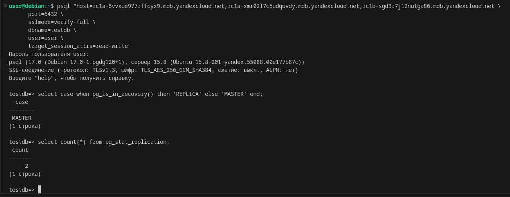
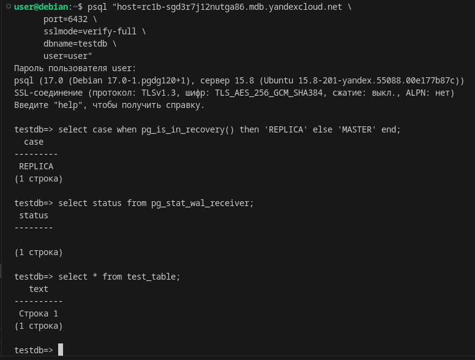

# Домашнее задание к занятию "`Базы данных в облаке`" - `Алексеев Александр`


### Инструкция по выполнению домашнего задания

   1. Сделайте `fork` данного репозитория к себе в Github и переименуйте его по названию или номеру занятия, например, https://github.com/имя-вашего-репозитория/git-hw или  https://github.com/имя-вашего-репозитория/7-1-ansible-hw).
   2. Выполните клонирование данного репозитория к себе на ПК с помощью команды `git clone`.
   3. Выполните домашнее задание и заполните у себя локально этот файл README.md:
      - впишите вверху название занятия и вашу фамилию и имя
      - в каждом задании добавьте решение в требуемом виде (текст/код/скриншоты/ссылка)
      - для корректного добавления скриншотов воспользуйтесь [инструкцией "Как вставить скриншот в шаблон с решением](https://github.com/netology-code/sys-pattern-homework/blob/main/screen-instruction.md)
      - при оформлении используйте возможности языка разметки md (коротко об этом можно посмотреть в [инструкции  по MarkDown](https://github.com/netology-code/sys-pattern-homework/blob/main/md-instruction.md))
   4. После завершения работы над домашним заданием сделайте коммит (`git commit -m "comment"`) и отправьте его на Github (`git push origin`);
   5. Для проверки домашнего задания преподавателем в личном кабинете прикрепите и отправьте ссылку на решение в виде md-файла в вашем Github.
   6. Любые вопросы по выполнению заданий спрашивайте в чате учебной группы и/или в разделе “Вопросы по заданию” в личном кабинете.
   
Желаем успехов в выполнении домашнего задания!
   
### Дополнительные материалы, которые могут быть полезны для выполнения задания

1. [Руководство по оформлению Markdown файлов](https://gist.github.com/Jekins/2bf2d0638163f1294637#Code)

---

### Задание  
**Создание кластера**
1. Перейдите на главную страницу сервиса Managed Service for PostgreSQL.  
2. Создайте кластер PostgreSQL со следующими параметрами:  
* класс хоста: s2.micro, диск network-ssd любого размера;  
* хосты: нужно создать два хоста в двух разных зонах доступности и указать необходимость публичного доступа, то есть публичного IP адреса, для них;  
* установите учётную запись для пользователя и базы.  

Остальные параметры оставьте по умолчанию либо измените по своему усмотрению.  

* Нажмите кнопку «Создать кластер» и дождитесь окончания процесса создания, статус кластера = RUNNING. Кластер создаётся от 5 до 10 минут.  

**Подключение к мастеру и реплике**
Используйте инструкцию по подключению к кластеру, доступную на вкладке «Обзор»: cкачайте SSL-сертификат и подключитесь к кластеру с помощью утилиты psql, указав hostname всех узлов и атрибут target_session_attrs=read-write.  

* Проверьте, что подключение прошло к master-узлу.
``` bash
select case when pg_is_in_recovery() then 'REPLICA' else 'MASTER' end;
```
* Посмотрите количество подключенных реплик:  
``` bash
select count(*) from pg_stat_replication;
```
### Ответ:  
1. Создание кластера выполнено через terraform:   
  
2. Скрин подключения и количества реплик (реплики 2, т.к. при создании HA-конфигурации требуется 2 хоста в одной зоне): 



**Проверьте работоспособность репликации в кластере** 

* Создайте таблицу и вставьте одну-две строки.  
``` bash
CREATE TABLE test_table(text varchar);
insert into test_table values('Строка 1');
```
* Выйдите из psql командой \q.
  
* Теперь подключитесь к узлу-реплике. Для этого из команды подключения удалите атрибут target_session_attrs и в параметре атрибут host передайте только имя хоста-реплики. Роли хостов можно посмотреть на соответствующей вкладке UI консоли.  
  
* Проверьте, что подключение прошло к узлу-реплике.  
``` bash 
select case when pg_is_in_recovery() then 'REPLICA' else 'MASTER' end;
```  
* Проверьте состояние репликации
``` bash
select status from pg_stat_wal_receiver;
```  
* Для проверки, что механизм репликации данных работает между зонами доступности облака, выполните запрос к таблице, созданной на предыдущем шаге:  
``` bash
select * from test_table;
```

В качестве результата вашей работы пришлите скриншоты:
1) Созданной базы данных; 2) Результата вывода команды на реплике select * from test_table;.

### Ответ:


